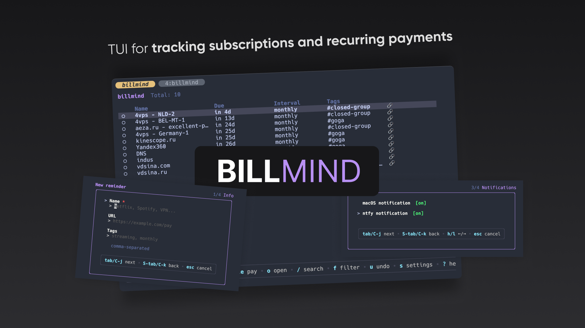
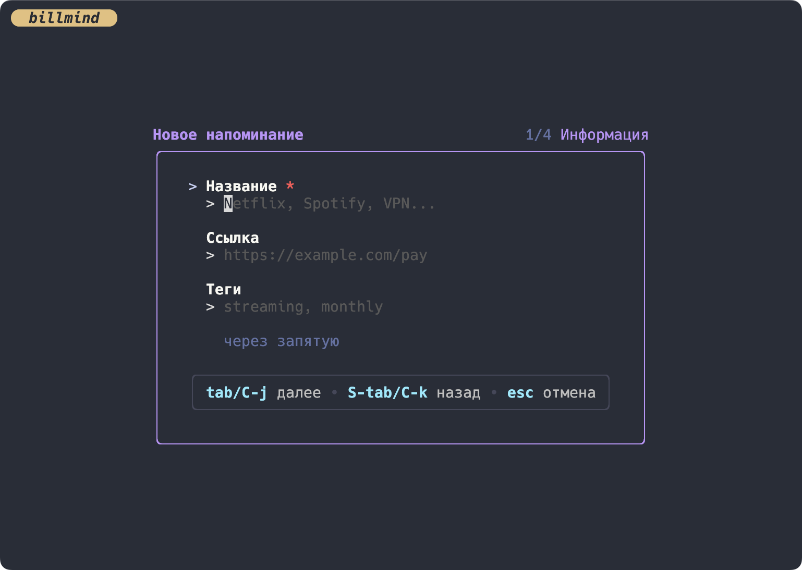
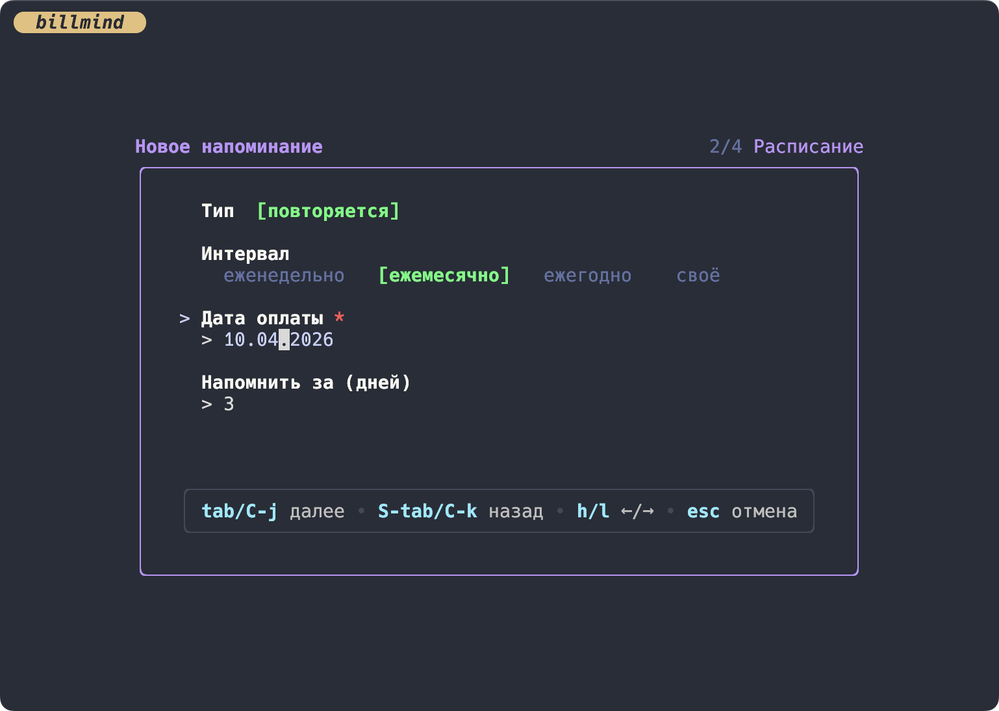
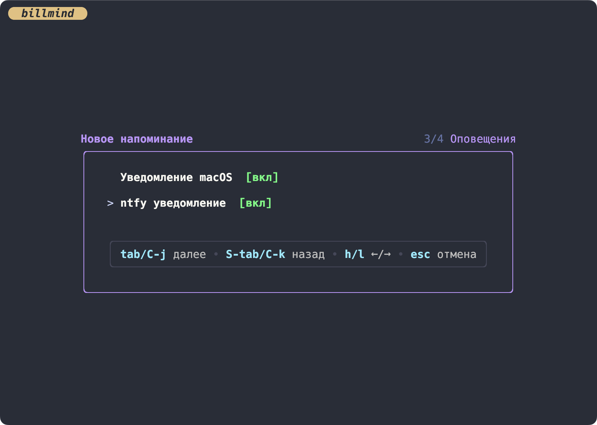

[Русский](README.md) | **English**

# billmind

A terminal app for tracking subscriptions and recurring payments. Never forget to pay for your VPS, domain, Netflix, or anything else — right from your terminal.



## Features

- Manage subscriptions and one-time payments
- Three notification stages: soft → urgent → critical
- System notifications (macOS, Linux, Windows) with TUI open button
- ntfy.sh push notifications to your phone — no signup required
- Background daemon — checks payments every hour
- Quiet hours (22:00–08:00) — no disturbance at night
- Vim-style navigation (j/k, gg/G, /, dd)
- Search and tag filtering
- Undo for any action
- Automatic backups (last 10)
- Russian and English language support

## Requirements

- Go 1.24+
- `terminal-notifier` (macOS, recommended for persistent notifications)

## Installation

### Homebrew (macOS / Linux)

```bash
brew tap curkan/public
brew install billmind
```

### Build from source

```bash
git clone https://github.com/curkan/billmind.git
cd billmind
go build -o billmind ./cmd/billmind
```

### Download binary

Pre-built binaries for all platforms are available on the [Releases](https://github.com/curkan/billmind/releases) page.

### macOS — install terminal-notifier (recommended)

```bash
brew install terminal-notifier
```

Without `terminal-notifier`, notifications use `osascript` but disappear after 5 seconds and have no action button. With `terminal-notifier` — persistent notifications with sound and a "Show" button.

## Usage

```bash
# Open TUI
./billmind

# Run daemon manually (check and send notifications)
./billmind daemon

# Install daemon into OS scheduler (runs every hour)
./billmind install

# Remove daemon from scheduler
./billmind uninstall
```

## Controls

### Navigation

| Key | Action |
|-----|--------|
| `j` / `↓` | Move down |
| `k` / `↑` | Move up |
| `gg` | Jump to top |
| `G` | Jump to bottom |

### Actions

| Key | Action |
|-----|--------|
| `a` | Add reminder (wizard) |
| `e` | Edit selected |
| `dd` | Delete (double tap + confirm) |
| `Space` | Mark as paid |
| `o` | Open URL in browser |
| `u` | Undo last action |
| `/` | Search by name, tags, URL |
| `f` | Filter by tags |
| `s` | Settings |
| `?` | Help |
| `q` | Quit |

### In forms (wizard / edit)

| Key | Action |
|-----|--------|
| `Tab` / `Ctrl+J` | Next field |
| `Shift+Tab` / `Ctrl+K` | Previous field |
| `Enter` | Save |
| `Esc` | Cancel |
| `Space` | Toggle checkbox |
| `h` / `l` | Cycle interval (← / →) |

## Wizard — adding a reminder

Creating a new reminder in 4 steps:

1. **Info** — name, URL (optional), comma-separated tags
2. **Schedule** — interval (weekly / monthly / yearly / custom / one-time), due date, remind days before
3. **Notifications** — system notifications (macOS/Linux/Windows), ntfy.sh (push to phone)
4. **Confirm** — summary, save

<details>
<summary>Wizard — creating a reminder</summary>


</details>

<details>
<summary>Wizard — schedule</summary>


</details>

<details>
<summary>Notifications</summary>


</details>

## Notification system

### Three stages (triad)

Each reminder goes through three notification stages per billing cycle:

| Stage | When | Example |
|-------|------|---------|
| **Soft** | N days before due | "Hetzner VPS — payment in 3 day(s) (May 01)" |
| **Urgent** | On due date | "Hetzner VPS — payment today!" |
| **Critical** | After due date | "Hetzner VPS — overdue by 2 day(s)" |

- Each stage fires **exactly once** — no spam
- Multiple payments on the same date — one batched notification
- Stages reset after payment for the next cycle

### Quiet hours

Default 22:00–08:00. The daemon does not send notifications during this time. On wake — catches up on missed notifications.

Configurable in `~/.config/billmind/data.json`:

```json
{
  "settings": {
    "quiet_hours_start": 22,
    "quiet_hours_end": 8
  }
}
```

### Catch-up after sleep

If the laptop was sleeping and missed several stages, the daemon sends only the **most relevant one**. It won't send "payment in 3 days" if it's already overdue.

### ntfy.sh — push notifications to your phone

[ntfy.sh](https://ntfy.sh/) lets you receive push notifications on your phone with no signup and no API keys.

**Setup (one-time):**

1. Install the ntfy app on your phone ([iOS](https://apps.apple.com/app/ntfy/id1625396347) / [Android](https://play.google.com/store/apps/details?id=io.heckel.ntfy))
2. Open the app and subscribe to a topic — pick a unique name, e.g. `billmind-john-2026` (it's like a private channel, only those subscribed can see it)
3. In billmind press `s` (settings) → `Tab` → type the same topic → `Esc`
4. When adding or editing a reminder, enable the ntfy toggle (wizard step 3 or `e` → ntfy toggle)

**Done.** Now each notification stage will send a push to your phone with sound.

**Verify:**

```bash
# Send a test notification manually
curl -d "Test notification from billmind" ntfy.sh/YOUR_TOPIC
```

If the push arrived on your phone — everything is set up correctly.

### Platforms

| Platform | System notifications | Push (ntfy.sh) | Scheduler |
|----------|---------------------|----------------|-----------|
| **macOS** | `terminal-notifier` (persistent + sound + button) / `osascript` (fallback) | HTTP POST | launchd (`~/Library/LaunchAgents/`) |
| **Linux** | D-Bus notify-send | HTTP POST | systemd user timer (`~/.config/systemd/user/`) |
| **Windows** | Windows Toast | HTTP POST | schtasks (Task Scheduler) |

## Data storage

All data is stored in `~/.config/billmind/`:

```
~/.config/billmind/
├── data.json           # Reminders and settings
├── daemon.log          # Daemon logs
└── backups/            # Automatic backups (up to 10)
    ├── data_2026-04-06_120000.json
    └── ...
```

### data.json structure

```json
{
  "reminders": [
    {
      "id": "550e8400-e29b-41d4-a716-446655440000",
      "name": "Hetzner VPS",
      "url": "https://console.hetzner.cloud/billing",
      "tags": ["work", "vps"],
      "interval": "monthly",
      "next_due": "2026-05-01T00:00:00Z",
      "remind_days_before": 3,
      "notifications": {
        "macos": true,
        "ntfy": true
      },
      "notify_stage": 0,
      "paid_at": null
    }
  ],
  "settings": {
    "language": "en",
    "ntfy_topic": "billmind-myname123",
    "quiet_hours_start": 22,
    "quiet_hours_end": 8
  }
}
```

### Payment intervals

| Value | Description |
|-------|-------------|
| `weekly` | Every week |
| `monthly` | Every month |
| `yearly` | Every year |
| `once` | One-time payment (removed after paid) |
| `custom` | Custom interval in days (`custom_days`) |

### Notification stages (notify_stage)

| Value | Stage | Description |
|-------|-------|-------------|
| `0` | none | Not yet notified |
| `1` | soft | Soft notification sent |
| `2` | urgent | Urgent notification sent |
| `3` | critical | Critical notification sent |

## Development

```bash
# Run in development mode
go run ./cmd/billmind

# Tests with race detector
go test ./... -race

# Test a specific package
go test ./internal/daemon/... -race -v

# Build
go build -o billmind ./cmd/billmind
```

### Architecture

The project follows the MVU (Model-View-Update) Elm architecture:

```
cmd/billmind/main.go          # Entry point + CLI subcommands
internal/
  ui/                          # TUI (Bubbletea v2)
    model.go                   # Application state
    update.go                  # Message handling
    view.go                    # Rendering
    handlers_*.go              # Per-screen handlers
    wizard.go                  # Add reminder wizard
  daemon/                      # Background daemon
    daemon.go                  # Run() orchestrator
    notify.go                  # Grouping and sending
    quiethours.go              # Quiet hours
  domain/                      # Domain models
    models.go                  # Reminder, Interval, NotifyStage
  storage/                     # Persistence (JSON)
  platform/                    # Platform abstractions
    darwin.go                  # macOS
    linux.go                   # Linux
    windows.go                 # Windows
    fallback.go                # Fallback
  ntfy/                        # ntfy.sh push notifications
  i18n/                        # Internationalization (ru/en)
```

## Troubleshooting

### Notifications disappear instantly (macOS)

Install `terminal-notifier`:

```bash
brew install terminal-notifier
```

Or change notification type in System Settings → Notifications → Script Editor → Alerts.

### Daemon won't start

Check logs:

```bash
cat ~/.config/billmind/daemon.log
```

Check scheduler status:

```bash
# macOS
launchctl list | grep billmind

# Linux
systemctl --user status com.billmind.daemon.timer
```

### Notifications not arriving

1. Check that `notifications.macos: true` or `notifications.ntfy: true` in the reminder
2. Check that it's not quiet hours (22:00–08:00)
3. Check `notify_stage` — if already `3`, all stages are exhausted until next cycle
4. Run daemon manually: `./billmind daemon`

### ntfy.sh notifications not arriving

1. Verify the topic matches in both the ntfy app and billmind settings (`s` → `Tab`)
2. Test manually: `curl -d "test" ntfy.sh/YOUR_TOPIC`
3. Check that `ntfy_topic` is set in settings and `notifications.ntfy: true` in the reminder

### Data lost

Check backups:

```bash
ls ~/.config/billmind/backups/
```

Restore the latest backup:

```bash
cp ~/.config/billmind/backups/data_LATEST.json ~/.config/billmind/data.json
```

## Releases

Instructions for publishing new versions — [RELEASING.md](RELEASING.md).

## License

MIT License

## Support

If you encounter issues, please create an issue:
https://github.com/curkan/billmind/issues
